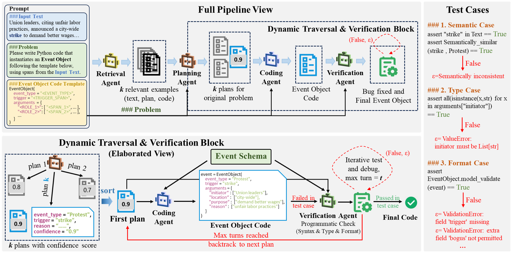

# ACE Events

This repository contains the code for my AAAI 2026 paper on zero-shot event extraction with a multi-agent programming framework.



## Paper

**Extracting Events Like Code: A Multi-Agent Programming Framework for Zero-Shot Event Extraction**  
Quanjiang Guo, Sijie Wang, Jinchuan Zhang, Ben Zhang, Zhao Kang, Ling Tian, Ke Yan  
*Proceedings of the AAAI Conference on Artificial Intelligence (AAAI 2026)*

## Overview

`ACE Events` is a clean public-release project for event extraction experiments on ACE-style benchmarks. It includes the current best-performing main pipeline code, evaluation scripts, schema prompt files, lightweight public experiment resources, and a simplified project structure suitable for GitHub release.

### Supported tasks

- End-to-end event extraction: `ace05-en`, `casie`, `genia2011`
- Event detection: `fewevent`, `speed`

### Included in this repository

- Core runnable source files only
- Multi-agent planning / coding / verification pipeline
- Public paper-eval split resources
- Official scorer wrapper and schema prompt files
- `models/` placeholder directory for local checkpoints
- `requirements.txt`, `LICENSE`, and a GitHub-friendly README

## Repository structure

- `main_experiment.py`: main experiment entry point
- `aec_pipeline.py`: multi-agent orchestration
- `planning_agent.py`: trigger/event planning
- `coding_agent.py`: argument/event construction
- `verification_agent.py`: trigger/argument verification
- `llm_utils.py`: OpenAI-compatible LLM client utilities
- `datasets/paper_eval_splits/`: public evaluation split resources included in this release
- `utils/code_schema_generation/init_prompts/`: schema prompt files for raw E2E mode
- `utils/code_evaluation/`: official evaluation wrapper
- `models/`: put local model checkpoints here if needed
- `results/`: recommended output directory for experiment results

## Installation

We recommend Python 3.11.

```bash
pip install -r requirements.txt
```

## Model support

This project supports any OpenAI-compatible endpoint.

### Open-weight models

The strongest local open-weight results in this codebase currently come from the Qwen family, especially:

- `Qwen/Qwen2.5-14B-Instruct`
- `Qwen/Qwen2.5-72B-Instruct`

The codebase also supports other OpenAI-compatible local models such as Llama 3 served by vLLM or another compatible backend.

### Built-in model aliases

- `llama3-8B` -> `meta-llama/Meta-Llama-3-8B-Instruct`
- `llama3-70B` -> `meta-llama/Meta-Llama-3-70B-Instruct`
- `gpt3.5-turbo` -> `gpt-3.5-turbo`
- `gpt4o` -> `gpt-4o`

## Model setup examples

### Example: local Qwen endpoint

```bash
export AEC_LLM_BASE_URL="http://127.0.0.1:8000/v1"
export AEC_LLM_API_KEY="EMPTY"
export AEC_LLM_MODEL="Qwen/Qwen2.5-14B-Instruct"
export AEC_LLM_TIMEOUT=240
export AEC_LLM_RETRIES=1
export AEC_LLM_FAIL_SOFT=1
export AEC_LLM_VERBOSE=1
export AEC_LLM_TOP_P=1.0
export AEC_LLM_SEED=1234
export PYTHONDONTWRITEBYTECODE=1
```

### Example: local alias-based setup

```bash
export AEC_LLM_BASE_URL="http://127.0.0.1:8000/v1"
export AEC_LLM_API_KEY="EMPTY"
export AEC_LLM_MODEL="llama3-8B"
export AEC_LLM_TIMEOUT=240
export AEC_LLM_RETRIES=1
export AEC_LLM_FAIL_SOFT=1
export AEC_LLM_VERBOSE=1
export AEC_LLM_TOP_P=1.0
export AEC_LLM_SEED=1234
export PYTHONDONTWRITEBYTECODE=1
```

### Example: third-party compatible API

```bash
export AEC_LLM_BASE_URL="https://your-openai-compatible-endpoint/v1"
export AEC_LLM_API_KEY="YOUR_API_KEY"
export AEC_LLM_MODEL="gpt-4o"
export AEC_LLM_TIMEOUT=240
export AEC_LLM_RETRIES=1
export AEC_LLM_FAIL_SOFT=1
export AEC_LLM_VERBOSE=1
export AEC_LLM_TOP_P=1.0
export AEC_LLM_SEED=1234
export PYTHONDONTWRITEBYTECODE=1
```

## Quick start

### Smoke test

```bash
python main_experiment.py \
  --dataset_name casie \
  --split test \
  --paper_eval \
  --sample_mode raw_e2e \
  --max_samples 10 \
  --use_llm_plan \
  --use_llm_coding \
  --planning_profile casie \
  --planning_backend dicore \
  --trigger_adapter none \
  --output_adapter none \
  --argument_mode hybrid \
  --max_hypotheses 8 \
  --raw_e2e_schema_mode gold \
  --output_file ./results/casie_smoke10.json
```

## Main experiment commands

### CASIE

```bash
python main_experiment.py \
  --dataset_name casie \
  --split test \
  --paper_eval \
  --sample_mode raw_e2e \
  --max_samples 50 \
  --use_llm_plan \
  --use_llm_coding \
  --planning_profile casie \
  --planning_backend dicore \
  --trigger_adapter none \
  --output_adapter none \
  --argument_mode hybrid \
  --max_hypotheses 8 \
  --raw_e2e_schema_mode gold \
  --save_trace \
  --output_file ./results/casie_qwen14b_50.json
```

### GENIA 2011

```bash
python main_experiment.py \
  --dataset_name genia2011 \
  --split test \
  --paper_eval \
  --sample_mode raw_e2e \
  --max_samples 250 \
  --use_llm_plan \
  --use_llm_coding \
  --planning_profile genia \
  --planning_backend dicore \
  --trigger_adapter none \
  --output_adapter none \
  --argument_mode hybrid \
  --max_hypotheses 8 \
  --raw_e2e_schema_mode gold \
  --save_trace \
  --output_file ./results/genia_qwen14b_250.json
```

### FewEvent

```bash
python main_experiment.py \
  --dataset_name fewevent \
  --split test \
  --paper_eval \
  --sample_mode raw_e2e \
  --max_samples 250 \
  --use_llm_plan \
  --use_llm_coding \
  --planning_profile generic \
  --planning_backend dicore \
  --trigger_adapter none \
  --output_adapter none \
  --argument_mode hybrid \
  --max_hypotheses 6 \
  --raw_e2e_schema_mode gold \
  --save_trace \
  --output_file ./results/fewevent_qwen14b_250.json
```

### SPEED

```bash
python main_experiment.py \
  --dataset_name speed \
  --split test \
  --paper_eval \
  --sample_mode raw_e2e \
  --max_samples 250 \
  --use_llm_plan \
  --use_llm_coding \
  --planning_profile generic \
  --planning_backend dicore \
  --trigger_adapter none \
  --output_adapter none \
  --argument_mode hybrid \
  --max_hypotheses 6 \
  --raw_e2e_schema_mode gold \
  --save_trace \
  --output_file ./results/speed_qwen14b_250.json
```

## Outputs

Each run writes:

- a full JSON file to `--output_file`
- a light JSON file with the same stem and `.light.json` suffix

Only **Primary metrics** are saved and printed:

- trigger identification: precision / recall / F1
- event identification: precision / recall / F1
- argument identification: precision / recall / F1
- argument classification: precision / recall / F1

## Dataset and license note

Due to license reason, the ACE 2005 dataset is only accessible to those with `LDC2006T06` license.

Therefore, this repository does **not** provide the raw ACE 2005 dataset itself, and this public release intentionally excludes non-public preprocessing artifacts and heavy derived resources. Please obtain the dataset from LDC and preprocess it according to your licensed access.

For other datasets, this repository only includes the lightweight public split resources needed for release-oriented reproduction. If you want to fully rebuild all processed inputs from scratch, you should prepare the corresponding raw datasets separately according to their original licenses.

## Notes

- `genia2011` currently expects a matching schema prompt file. Add `utils/code_schema_generation/init_prompts/genia2013.txt` if you want to run GENIA raw E2E mode without errors.
- If you use a third-party compatible API, always verify the exact model name supported by that provider.
- Local model weights are intentionally excluded from GitHub; place them under `models/`.

## Citation

If you use this code, please cite:

```bibtex
@inproceedings{guo2026extracting,
  title={Extracting Events Like Code: A Multi-Agent Programming Framework for Zero-Shot Event Extraction},
  author={Guo, Quanjiang and Wang, Sijie and Zhang, Jinchuan and Zhang, Ben and Kang, Zhao and Tian, Ling and Yan, Ke},
  booktitle={Proceedings of the AAAI Conference on Artificial Intelligence},
  volume={40},
  number={37},
  pages={30880--30887},
  year={2026}
}
```
